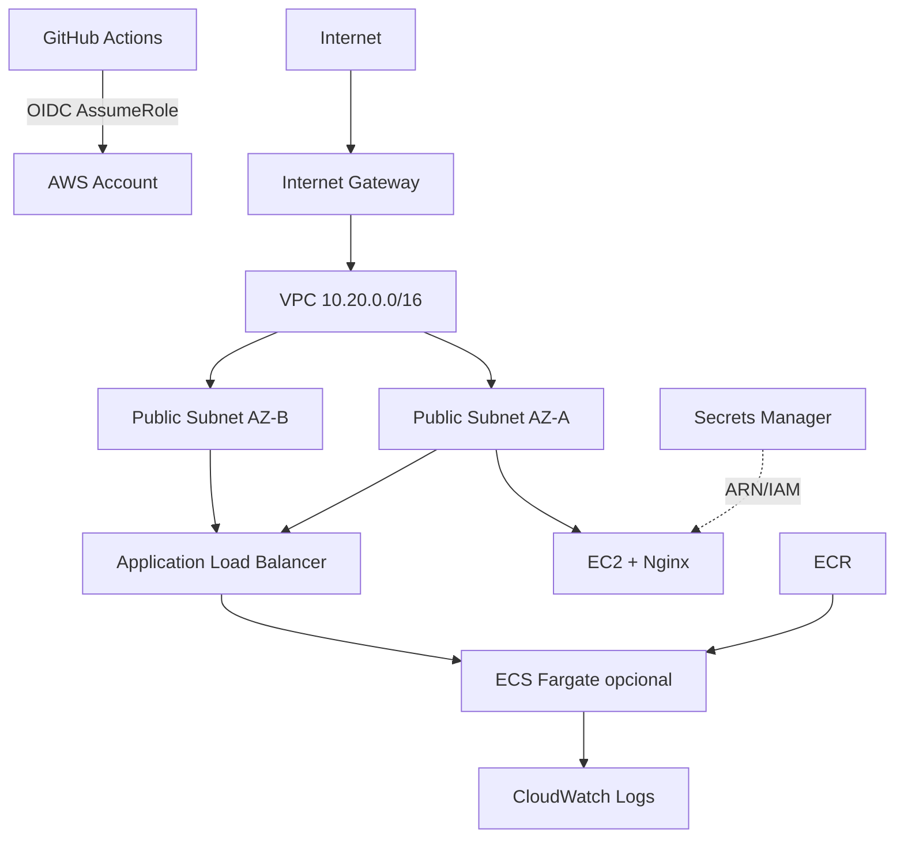

# ACME Terraform AWS

Projeto de Infrastructure as Code para provisionar uma aplicação simples na AWS com Terraform.

## Entregas

- EC2 Amazon Linux 2023 com Nginx.
- VPC com duas sub-redes públicas em AZs diferentes.
- Internet Gateway, rotas e Security Group.
- IAM Role para EC2 com acesso via AWS Systems Manager Session Manager.
- Secrets Manager sem gravar valor sensível no código ou no state.
- ECS/Fargate opcional, com ECR, ALB, logs e serviço distribuído em duas AZs.
- Backend remoto S3 com lockfile nativo do Terraform.
- Pipeline GitHub Actions com fmt, validate, plan e apply.
- Autenticação GitHub → AWS por OIDC.

## Arquitetura



## Pré-requisitos

1. Conta AWS e permissões administrativas somente para o bootstrap inicial.
2. Terraform >= 1.10.
3. AWS CLI autenticada.
4. Repositório GitHub.

## 1. Criar backend e role OIDC

O bootstrap é executado uma única vez e cria:

- bucket S3 para o state;
- criptografia e versionamento;
- IAM OIDC Provider do GitHub;
- IAM Role utilizada pelo pipeline.

```bash
cd bootstrap
cp terraform.tfvars.example terraform.tfvars
# Edite github_org e github_repository
terraform init
terraform plan
terraform apply
```

Copie os outputs `state_bucket_name` e `github_actions_role_arn`.

## 2. Configurar o ambiente dev

```bash
cd ../environments/dev
cp backend.hcl.example backend.hcl
cp terraform.tfvars.example terraform.tfvars
```

Edite `backend.hcl` com o bucket criado. Depois:

```bash
terraform init -backend-config=backend.hcl
terraform fmt -recursive -check
terraform validate
terraform plan
terraform apply
```

## 3. Configurar GitHub

Em **Settings > Secrets and variables > Actions > Variables**, crie:

- `AWS_ROLE_ARN`: ARN retornado pelo bootstrap.
- `TF_STATE_BUCKET`: nome do bucket retornado pelo bootstrap.

O workflow executa `plan` em pull requests e `apply` somente em push para `main`.

## 4. Testar a EC2

Após o apply:

```bash
terraform output ec2_public_url
```

Abra a URL retornada. A instância pode ser acessada sem SSH pelo Session Manager:

```bash
aws ssm start-session --target $(terraform output -raw ec2_instance_id)
```

## 5. Ativar ECS/Fargate

No `terraform.tfvars`:

```hcl
enable_ecs = true
```

A primeira implantação usa a imagem pública `nginx:alpine`. O módulo também cria um ECR para receber a aplicação real.

## Secrets

O Terraform cria somente o contêiner lógico do segredo. O valor é inserido fora do código:

```bash
aws secretsmanager put-secret-value \
  --secret-id acme/dev/application \
  --secret-string '{"username":"app","password":"ALTERE-ME"}'
```

Isso evita colocar segredos em arquivos `.tfvars`, Git ou outputs. Para produção, restrinja a policy do consumidor ao ARN exato do segredo.

## Destruir o laboratório

```bash
terraform destroy
```

Antes de destruir o bootstrap, remova os states existentes do bucket ou preserve o backend.
